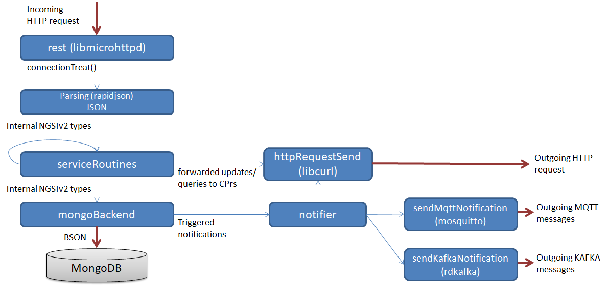

# ハイ・レベルな内部アーキテクチャ (High level internal architecture)

## 概要

このドキュメントでは、Orion Context Broker の内部アーキテクチャの概要を紹介します。これは、[さまざまなライブラリ](sourceCode.md)の詳細に入る前に紹介として役立つはずです。しかし、これは単なる概観であり、網羅的なものではないことに注意してください。

次の図は、主要な情報の流れと、プログラムの制御があるモジュールから別のモジュールにどのように移行するかを示しています。内部フローの詳細なリストについては、[このセクション](flowsIndex.md)を参照してください。

_現在の Orion の内部アーキテクチャ_

* 起動時に、Orion Context Broker は着信リクエストをリッスンする HTTP サーバを開始します。**残り**のライブラリはこれらのリクエストを処理し、そのライブラリは microhttpd 外部ライブラリに基づいており、リクエストごとに新しいスレッドが生成されます。

* `connectionTreat()`関数は、新しいリクエストのエントリポイントです。詳細は、図 [RQ-01](sourceCode.md#flow-rq-01) を参照してくだい。
* ロジックは次のようになります :
	* まず、[**jsonParseV2** library](sourceCode.md#srclibjsonparsev2) はリクエスト・ペイロードを入力として受け取り、一連のオブジェクトを生成します。NGSIv2 パーシング・ロジックは [rapidjson](http://rapidjson.org) に基づいています。
        * 次に、リクエストを処理するためにサービスルーチンが呼び出されます。各リクエストタイプ（HTTP および URL パターン）には、ライブラリ [**serviceRoutinesV2**](sourceCode.md#srclibserviceroutinesv2) に格納されているサービスルーチンがあります。一部のサービスルーチンは他のサービスルーチンを呼び出す場合があることに注意してください（詳細は[マッピングドキュメント](ServiceRoutines.txt)を参照してください）
        * 最後に、**mongoBackend** ライブラリが呼び出されます
* [**mongoBackend** ライブラリ](sourceCode.md#srclibmongobackend)は、ある意味で Orion の「頭脳」です。Orion が実行する様々な操作（エンティティ情報の取得、エンティティの更新、サブスクリプションの作成など）を目的とした一連の関数が含まれています。このライブラリは、対応する [MongoDB C ドライバ](http://mongoc.org)ドライバを "ラップ" する **mongoDriver** ライブラリを使用して MongoDB とインターフェースします
* 通知がトリガーされるたびに (たとえば、既存のサブスクリプションでカバーされるエンティティを更新した結果として)、通知モジュール([**ngsiNotify** ライブラリ](sourceCode.md#srclibngsinotify) にある) が **mongoBackend から呼び出されます**。このような通知を送信するため、Orion は2つの通知タイプをサポートしています
        * HTTP 通知。この場合、`httpRequestSend()` 関数 (**rest** ライブラリの一部) が HTTP リクエストの送信を担当します。これは、[libcurl](https://curl.haxx.se/libcurl/) 外部ライブラリに基づいています
        * MQTT 通知。この場合、`sendMqttNotification()` 関数 (**mqtt** ライブラリの一部) は、対応する MQTT broker での MQTT 通知の公開を担当します。これは、[mosquitto](https://mosquitto.org/api/files/mosquitto-h.html) 外部ライブラリに基づいています
        * KAFKA 通知。この場合、`sendKafkaNotification()` 関数（**kafka** ライブラリの一部）が、対応する KAFKA ブローカーへの KAFKA 通知の発行を担当します。この関数は [rdkafka](https://github.com/confluentinc/librdkafka) 外部ライブラリに基づいています
* `httpRequestSend()` 関数は、特定の条件下でクエリ/更新を[コンテキスト・プロバイダ](../user/context_providers.md) に転送できる**serviceRoutinesV2** 関数によっても呼び出されます

[トップ](#top)

## 歴史

Orion Context Broker (0.1.0) の最初のバージョンは、2013年5月14日にリリースされました。純粋な NGSIv1 であり、リクエスト/レスポンスペイ・ロード形式として XML のみに基づいています。その時点で、property_tree は XML の文字列ベースの性質 (XML では、JSON と同じように、数値、ブール値などをネイティブ型として持たない) によく合致するので、パーシング・ライブラリとして選択されました。

アーキテクチャ上の観点から、次の重要なマイルストーンは、Orion ユーザの大規模なコミュニティによってリクエストされた JSON レンダリングの追加でした。その作業はバージョン 0.8.1 (2013年10月30日) から開始し、0.10.0 (2014年2月20日) に終了しました。幸いにも、property_tree パーサーも JSON をサポートしていましたので、アーキテクチャ設計には大きな影響はありませんでした。新しい JSON 形式のパース/レンダリングのロジックを書く必要がありました。

2015年7月に、NGSIv2 (NGSIv2 機能付き Orion の最初のバージョン、まだベータ版で、0.23.0) を導入しました。これは NGSIv1 のより簡単で拡張されたバージョンです。NGSIv2 はパーシング・ロジックにとって重要な要件をもたらしました。JSON ネイティブ・タイプをサポートする必要があります。したがって、property_tree は十分ではなく、タスクを実行するために別のライブラリを選択する必要がありました。新しいパーシング・ライブラリ **jsonParseV2** (rapidjson に基づいた) がこの目的のために開発されました。同じ代価で、rapidjson はより簡単なプログラミング・モデルを導入し、最も効率的な既存モデルの1つです。

NGSIv2 はまた、新しい V2 サービス・ルーチンを保持するために開発した新しい **serviceRoutinesV2**  library (`/v2` URL プレフィックスの下にあるものすべて) を実装するための、新しい HTTP リクエストのセットをもたらしました。場合によっては、NGSIv1 の機能を再利用することができました。つまり、V2 サービス・ルーチンの一部が V1 サービス・ルーチンを呼び出します。しかし、NGSIv1 で対応していない新機能 (新しい *list subscriptions* リクエストなど)では、V2 サービス・ルーチンが mongoBackend ライブラリを直接呼び出します。新しい機能を扱うために新しい関数で拡張する必要がありました。

上のアーキテクチャー図では、NGSIv2 に関連する新しい追加がオレンジ色で強調表示されています。

もう一つのアーキテクチャの進化 (今回は通信に関連する) は、発信 HTTP リクエストを直接処理 (つまり、リクエストを直接 TCP ソケットに書き込む) から、本格的な HTTP 指向のライブラリとしての libcurl の使用に移行していました。これは Orion 0.14.1 (2014年8月1日) で行われました。このようにして、HTTP プロトコルの微妙な細部がすべて考慮されています。実際、Orion 0.14.1 ではいくつかのバックエンドに通知を送信する問題を解決しました。

## NGSIv1 の削除

アーキテクチャの進化の重要な成果の1つは、NGSIv1 API との完全な下位互換性を維持しながら、API の新しいバージョン (NGSIv2) 全体を開発できることでした (Orion1.0.0 で廃止された XML のレンダリングを除いて...それの後ろにひどい遺産として property_tree を残して:)。

しかし、これは "並列" アーキテクチャにつながり、いくつかの非効率な側面（特に、**mongoBackend** へのより直接的なフローではなく、サービスルーチン呼び出しの "チェーン"）がありました。そのため、NGSIv1 が非推奨と宣言され、Orion の目標が NGSIv2 のみをサポートすることになったら、いずれ統合する必要がありました（XML レンダリングが非推奨となり、最終的に削除されたのと同様に）。

Orion 4.0.0 では API の観点からNGSIv1 が削除されましたが、Orion 4.3.0 では統合が行われ、内部アーキテクチャの一部が統一されました (例: `serviceRoutines` は `serviceRoutinesV2` に、`ngsi10` は `ngsi` に統合されました)。NGSIv1 関連の多くのデッドコードが完全に削除されました。

## まだ保留中

いくつかの高レベルタスクが保留中です:

1. NGSI 型を統合します (**orionType**, **ngsi**, **apiTypesV2** を再設計して統合する必要があります)。NGSIv1 から移行した古い型のほとんどは ngsi に含まれています
2. **serviceRoutinesV2** と **mongoBackend** を新しい型に適合させます

[トップ](#top)
